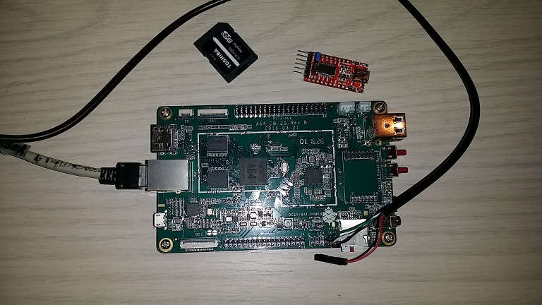

# Pine 64

## Linux Kernel for the Pine64
There is currently support for the Pine64 board in the mainline / vanilla kernel.

See the [kernel](./10-kernel/README.md) directory for instructions.

## Das U-Boot
U-boot is a boot loader which may be used on the Pine64.

See the [Das U-Boot](./15-u-boot/README.md) directory for instrutions on the boot loeader.

## Buildroot
Download the build environment from **[BLDRT]**; the pages comes with instructions how to build an OS image.

See the [buildroot](./20-buildroot/README.md) directory for a description and examples how to build an image for the Pine64.

## Arch Linux ARM
Arch Linux images and instructions may be downloaded from **[ARCH1]**.

# Links
## Basic Information
* **[PINE1]** [Pine64 Web Page](https://www.pine64.org)

* **[PINE2]** [Wiki: Pine64 Main Page](http://wiki.pine64.org/index.php/PINE_A64_Main_Page)

* **[SNXI1]** [Sunxi Pine64 Wiki](http://linux-sunxi.org/Pine64)

## OS Images
* **[OSIMG]** [Pine A64 Software Release](http://wiki.pine64.org/index.php/Pine_A64_Software_Release)

* **[ARMBN]** [Armbian Distribution](https://www.armbian.com/)

* **[ARCH1]** [Pine64 Arch Linux ARM](https://archlinuxarm.org/platforms/armv8/allwinner/pine64)

* **[BLDRT]** [Buildroot - Making Embedded Linux Easy](https://buildroot.org/)

## Development, Kernel, HowTo
* **[LINA1]** [Gnu GCC and LLVM Toolchains](https://www.linaro.org/downloads)

* **[LINA1]** [Linaro ARM toolchains ( - 8)](http://releases.linaro.org/components/toolchain/binaries)

* **[LINA3]** [Linaro ARM toolchains (11.3 - )](https://snapshots.linaro.org/gnu-toolchain)

* **[ARMDV1]** [ARM Developer Resources](https://developer.arm.com)

* **[ARMDV2]** [Arm GNU Toolchain](https://developer.arm.com/Tools%20and%20Software/GNU%20Toolchain)

* **[AYUF1]** [Kamil Trzciński's Pine A64 and Pinebook experiments](https://github.com/ayufan-pine64)

* **[UMID1]** [Uli Middelberg: How To compile a custom Linux kernel for your ARM device](https://github.com/umiddelb/armhf/wiki/How-To-compile-a-custom-Linux-kernel-for-your-ARM-device) *(dated)*

* **[LNGS1]** [Simon Eisenmann: Build Pine 64 Image](https://github.com/longsleep/build-pine64-image) *(dated)*

* **[APRI1]** [Andre Przywara: Usage Instructions For the Image Files (w. FW Images)](https://github.com/apritzel/pine64) *(dated)*

* **[APRI2]** [Andre Przywara: ARM Trusted Firmware - version 1.0](https://github.com/apritzel/arm-trusted-firmware) *(dated)*

* **[APRI3]** [Andre Przywara: Linux Kernel 4.x](https://github.com/apritzel/linux/tree/a64-v6-wip) *(dated)*

## Kernel Repositories
* **[GHUB1]** [GitHub: Torvalds' Kernel](https://github.com/torvalds/linux)

* **[KRNL1]** [Kernel.org: Torvalds' Kernel](https://git.kernel.org/pub/scm/linux/kernel/git/torvalds/linux.git)

* **[KRNL2]** [Kernel.org: Linux Stable](https://git.kernel.org/pub/scm/linux/kernel/git/stable/linux-stable.git)

* **[SNXI1]** [Kernel.org: Sunxi Kernel](https://git.kernel.org/pub/scm/linux/kernel/git/sunxi/linux.git)

* **[APRI4]** [GitHub: Sunxi64 Kernel 4.9 by apritzel](https://github.com/apritzel/linux/tree/sunxi64-4.9-testing)

* **[OSKA1]** [GitHub: Sunxi64 Kernel 4.9 by apritzel ans oska874](https://github.com/oska874/linux-pine64) based on **[APRI4]**

* **[LNGS2]** [GitHub: Kernel 3.10 by longsleep](https://github.com/longsleep/linux-pine64)

* **[AYUF2]** [GitHub: Kernel 3.10 by ayufan](https://github.com/ayufan-pine64/linux-3.10)

## MarkDown
* **[MD1]** [Markdown Cheatsheet](https://github.com/adam-p/markdown-here/wiki/Markdown-Cheatsheet)

* **[MD2]** [GitHub Flavored Markdown](https://guides.github.com/pdfs/markdown-cheatsheet-online.pdf)
